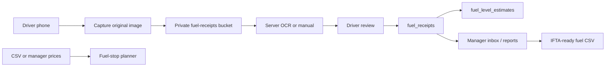

# FuelTrail

**Every gallon. Every truck. One clear trail.**

FuelTrail is a mobile-first PWA for a small trucking company. Drivers photograph diesel receipts after fueling. The original image is stored privately and never overwritten. OCR can prefill fields, but the driver must confirm values before submission. Managers work truck-first: spend, gallons, estimated fuel, exceptions, IFTA-ready fuel-purchase exports, savings observations, and fuel-stop planning.

This is **not** a complete IFTA filing product, live tank sensor, or fuel-card processor.

## Installed versions

Recorded at implementation time (see `pnpm-lock.yaml` for the lockfile):

- Next.js 16.3.1 (App Router, TypeScript strict)
- React 19.2.8
- Tailwind CSS 4.3.3
- pnpm 10.34.5
- `@supabase/ssr` + `@supabase/supabase-js`
- Zod, React Hook Form resolvers, Recharts, Vitest, Playwright

Local app URL: **http://localhost:3021** (port 3000 is often busy on this machine).

## Architecture

```text
src/app/(auth)            Sign-in, password reset
src/app/(driver)/driver   Driver home, capture, review, offline queue
src/app/(management)/manage  Truck-first dashboard, receipts, reports, planning
src/app/api               Auth-checked route handlers
src/lib/calculations      Pure, unit-tested math
src/lib/ocr               ReceiptOcrProvider (manual, Mindee, Gemini, OpenAI)
src/lib/routing           FuelRouteProvider (manual + HERE)
supabase/migrations       Schema, RLS, private storage, views
```



Privileged work (invites, signed Storage URLs, OCR provider keys, service role) stays on the server. The service-role key must never appear in client bundles.

## Setup

1. Copy `.env.example` to `.env.local` and fill Supabase values.
2. Create a Supabase project.
3. In Auth, set Site URL and redirect URLs to `http://localhost:3021` and `/auth/confirm`.
4. Apply migrations with the project CLI (`pnpm supabase`, not a global `supabase` command unless you also installed Homebrew):

```bash
pnpm install
pnpm db:login
pnpm db:link
pnpm db:push
pnpm db:seed
pnpm bootstrap:owner
pnpm seed:demo
pnpm dev
```

`db:link` asks for the database password from the Supabase project (Settings → Database). Docker is not required for `db push` to a hosted project.

`pnpm bootstrap:owner` needs `BOOTSTRAP_OWNER_EMAIL` and `BOOTSTRAP_OWNER_PASSWORD`. It is a local script, not a public endpoint.

Demo users from `pnpm seed:demo` (password `FuelTrail-demo-1` unless overridden):

- `manager@gulfcoasthaul.example`
- `driver.a@gulfcoasthaul.example` (truck 101)
- `driver.b@gulfcoasthaul.example` (truck 202)

## Environment

| Variable | Purpose |
| --- | --- |
| `NEXT_PUBLIC_APP_URL` | `http://localhost:3021` locally |
| `NEXT_PUBLIC_SUPABASE_URL` | Project URL |
| `NEXT_PUBLIC_SUPABASE_PUBLISHABLE_KEY` | Browser/server cookie client (publishable / anon) |
| `SUPABASE_SERVICE_ROLE_KEY` | Server only: invites, signed uploads |
| `RECEIPT_OCR_PROVIDER` | `auto` (default), `manual`, `mindee`, `gemini`, or `openai` |
| `GEMINI_API_KEY` | Optional Google AI Studio key for vision receipt OCR |
| `MINDEE_API_KEY` | Mindee V1 expense receipts key |
| `FUEL_ROUTE_PROVIDER` | `manual` (default) or `here` |
| `HERE_API_KEY` | Optional Routing API v8 key |
| `CRON_SECRET` | Reserved for future jobs |
| `RESEND_API_KEY` | Optional. Sends alert emails when a user opts in |
| `RESEND_FROM_EMAIL` | Verified Resend from address, e.g. `FuelTrail <alerts@yourdomain.com>` |

If Mindee is selected but misconfigured, the app falls back to manual entry and keeps the original image. If HERE lacks Fuel Prices access, routing/manual prices still work.

## Testing

```bash
pnpm lint
pnpm typecheck
pnpm test
pnpm test:e2e
pnpm build
```

Playwright starts the app on port 3021 and runs public pages on phone, tablet, and desktop viewports. The 11 Phase 2 journeys live in `tests/e2e/journeys.spec.ts`. Authenticated journeys need `E2E_DRIVER_EMAIL` / `E2E_MANAGER_EMAIL` (and matching passwords) after `pnpm seed:demo`. GitHub Actions always runs the public and journey files; seeded steps skip unless those secrets are set on the repository.

Domain coverage for the same 11 journeys also runs in `pnpm test` (`src/lib/journeys/phase2.test.ts`).

## Vercel

1. Create the Supabase project and run migrations.
2. Configure Auth URLs for the Vercel production and preview domains.
3. Create the Vercel project from this GitHub repository.
4. Set environment variables separately for Development, Preview, and Production. Never put `SUPABASE_SERVICE_ROLE_KEY` in `NEXT_PUBLIC_*`.
5. Deploy.
6. Bootstrap the first owner with the script against production env vars, then run smoke tests on a real phone.

If Git remotes are not configured yet:

```bash
git remote add origin git@github.com:<org>/<repo>.git
git push -u origin main
```

Do not invent a GitHub URL. Create the repository first.

## Known limitations

- IFTA worksheet covers **fuel purchases**. Distance by jurisdiction is out of scope.
- Estimated fuel is a calculation, not telematics.
- Offline capture uses IndexedDB plus a visible Retry control. iOS background sync is not promised.
- Live fuel prices require a commercial HERE (or other) contract; CSV/manual prices are the MVP path.
