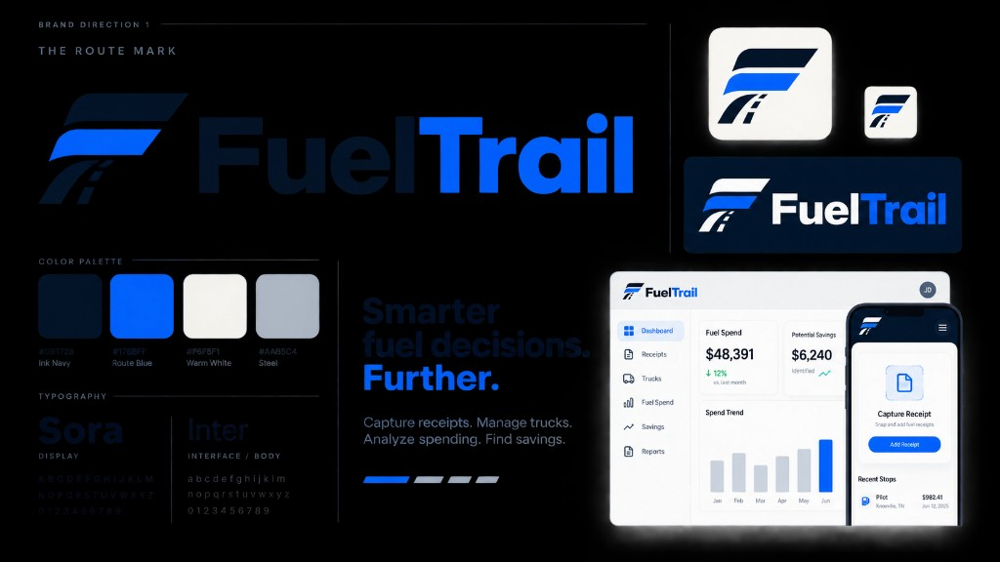

# FuelTrail style guide

Canonical brand board (save and follow this image):

This kit is the source of truth for every surface: marketing, login, driver, manager, and platform admin. Taste Skill ([Leonxlnx/taste-skill](https://github.com/Leonxlnx/taste-skill)) is how we execute it. Do not invent a second palette, type pairing, or logo.

## Design read

Reading this as: B2B fleet fuel product for drivers in a truck cab and managers at a desk, with the attached FuelTrail kit as law, leaning toward Tailwind v4 + Sora display + Inter body + Route Blue as the only brand accent.

Dials (Taste Skill v2):

| Dial | Value | Why |
| --- | --- | --- |
| `DESIGN_VARIANCE` | 4 | Kit is structured: sidebar, cards, clear hierarchy. Not experimental. |
| `MOTION_INTENSITY` | 3 | Hover, press, focus. Drivers should not fight animation. |
| `VISUAL_DENSITY` | 6 manager / 4 driver | Dashboards carry data; driver home stays capture-first. |

## Tokens

| Name | Hex | Role |
| --- | --- | --- |
| Ink Navy | `#0B1728` | Text, dark chrome, wordmark “Fuel”, default filled controls |
| Route Blue | `#176BFF` | Sole brand accent: primary CTAs, active nav, “Trail” |
| Warm White | `#F6F5F1` | App canvas |
| Steel | `#AAB5C4` | Borders, charts, inactive icons |
| Muted | `#4E5C6B` | Secondary **readable** text (Steel fails WCAG on Warm White) |

Semantic status colors (not brand accents): success `#1F8A5B`, alert `#C4453C`. Do not introduce amber, purple, or a second accent.

In code these live in `src/config/brand.ts` and `src/app/globals.css` (`ink`, `route`, `warm`, `steel`, `muted`).

## Type

- **Sora** (`font-display`): page titles, metric figures, brand wordmark.
- **Inter** (`font-sans`): UI, forms, tables, helper copy.
- Headlines: tracking-tight, sentence case, `text-wrap: balance`.
- Data: `tabular-nums`.
- Inter is required by this kit. Do not swap it for Geist.

## Logo

The Route Mark is a geometric **F**: top bar split Ink Navy / Route Blue, middle bar Route Blue, stem and base as a receding road with a dashed centerline.

- On Warm White or white: navy + Route Blue mark, “Fuel” in Ink Navy, “Trail” in Route Blue.
- On Ink Navy: white + Route Blue mark, “Fuel” in white, “Trail” in Route Blue.
- App icon: white rounded square, Route Mark centered. Source: `public/icons/icon.svg`.

Do not revive the old amber teardrop mark.

## Voice

- Tagline: **Smarter fuel decisions. Further.**
- Value line: **Capture receipts. Manage trucks. Analyze spending. Find savings.**
- Product copy stays plain and specific. No “seamless,” “unleash,” or em-dash flourish in marketing UI.

## Layout by surface

**Marketing / login:** Split Ink Navy brand panel + Warm White form or story. Primary CTA is Route Blue. Secondary is outline.

**Driver (mobile):** Ink Navy header, capture card first, full-width Route Blue “Add receipt,” then recent stops. 44px minimum hit targets.

**Manager (desktop):** Left sidebar, active item is a light Route Blue pill. Metric cards with large Sora figures. Content max width ~1400px.

**Admin:** Same kit and sidebar language as manager. No separate “admin skin.”

## Shape and motion

- Cards `rounded-xl` (12px), buttons `rounded-lg` (10px), inputs `rounded-md` (8px).
- Shadows tinted with Ink Navy, never pure black.
- `:active` uses `scale-[0.98]`. Focus ring is Route Blue.
- Honor `prefers-reduced-motion`.

## Agent checklist

Before shipping UI:

1. Open [fueltrail-style-guide.png](./fueltrail-style-guide.png).
2. Use kit tokens, not leftover `#F5A524` amber or `#0B1F33` navy.
3. One accent: Route Blue.
4. Sora for display, Inter for interface.
5. Do not add Lucide if Phosphor is already in the tree; keep one icon family.
